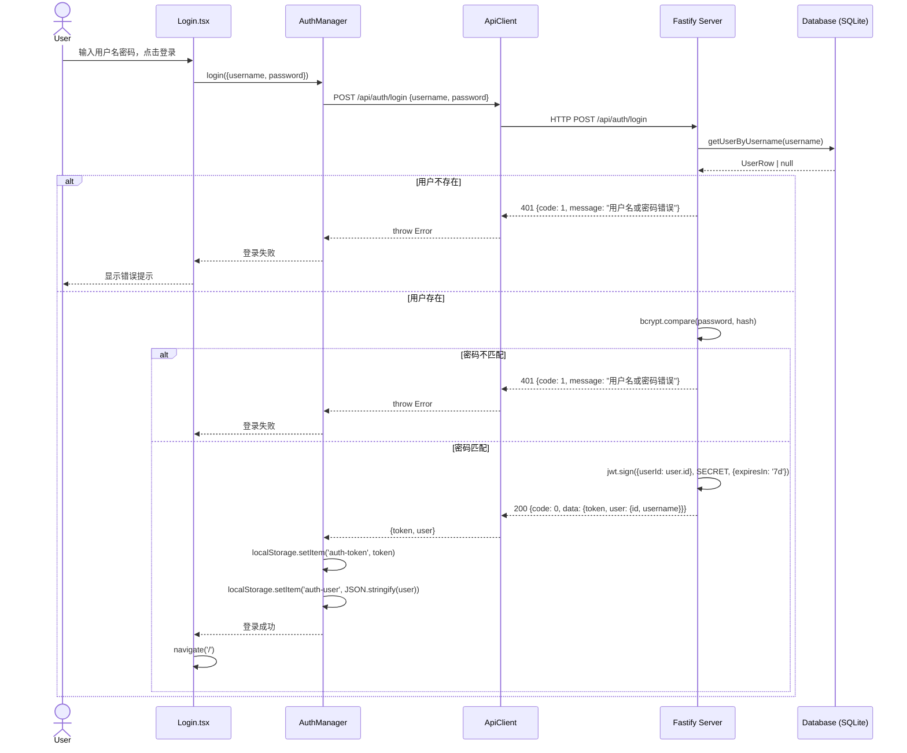
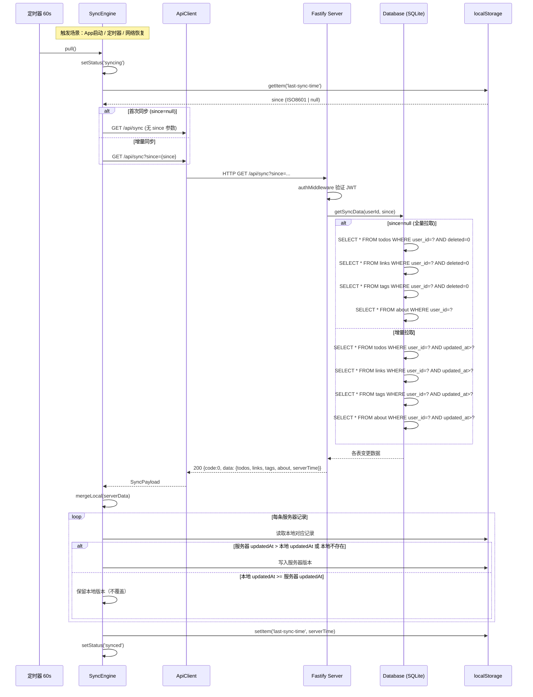
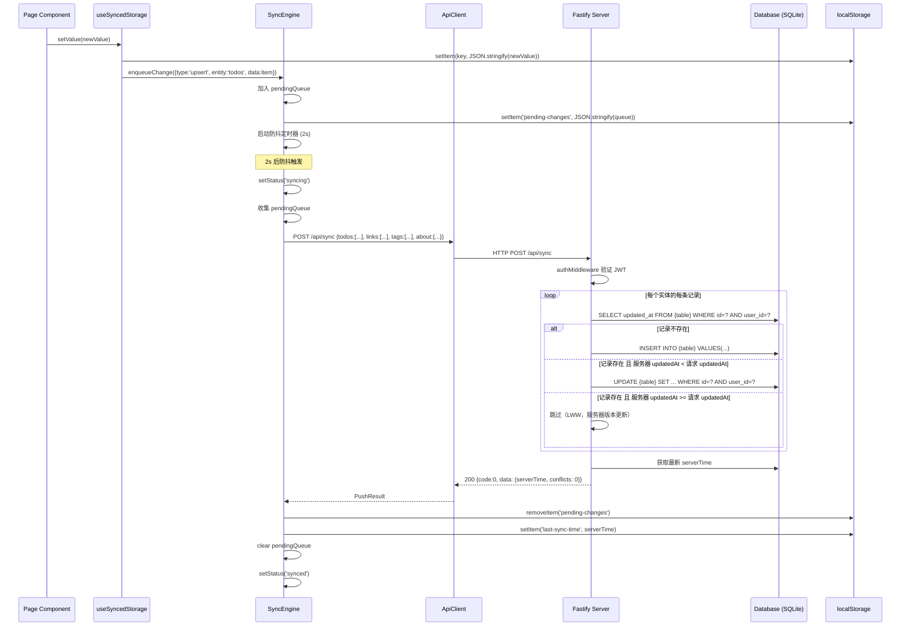
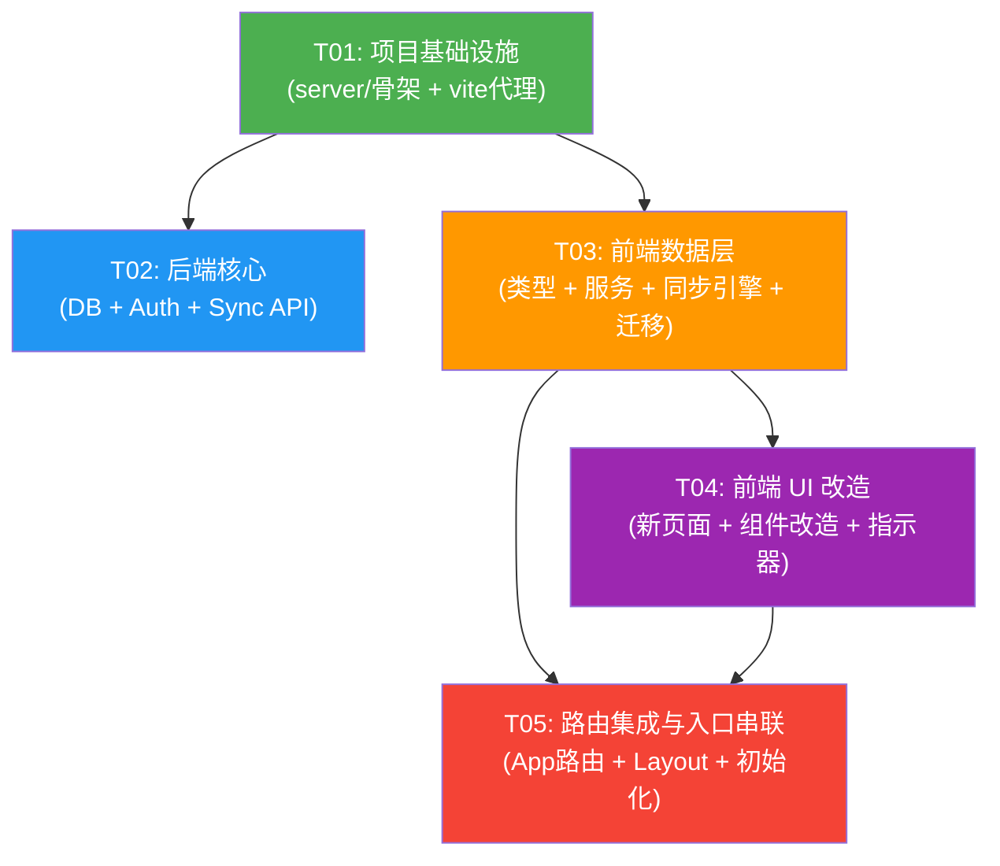

# 多设备数据同步 — 系统架构设计

> 项目：personal-utility-site（个人实用工具站）
> 增量功能：多设备数据同步
> 架构师：高见远（Gao）
> 日期：2026-06-17

---

## Part A：系统设计

### 1. 实现方案与框架选型

#### 1.1 核心技术挑战

| # | 挑战 | 解决方案 |
|---|------|----------|
| C1 | 多设备 ID 碰撞 | `crypto.randomUUID()` 替代 `Date.now().toString()`，保证全局唯一 |
| C2 | 增量同步的一致性 | 统一 `updatedAt` 时间戳 + 服务器时钟为权威来源 + Last-Write-Wins 冲突策略 |
| C3 | 离线数据不丢失 | localStorage 持久化 `pendingChanges` 队列，网络恢复自动 flush |
| C4 | 旧数据平滑迁移 | 幂等迁移脚本：检测缺失字段再补填，保留原始 ID，不破坏现有数据 |
| C5 | 同步引擎循环依赖 | 同步引擎不依赖任何 UI 组件；通过回调/事件通知 UI 层状态变化 |
| C6 | 2C2G 服务器资源限制 | Fastify（低内存）+ SQLite（无独立进程）+ 60s 轮询（非长连接） |

#### 1.2 框架选型

| 层 | 选型 | 版本 | 选型理由 |
|----|------|------|----------|
| 后端框架 | **Fastify** | ^5.x | 性能优于 Express 2-3 倍；内置 JSON Schema 校验；插件体系轻量；TypeScript 原生支持好 |
| 数据库驱动 | **better-sqlite3** | ^11.x | 同步 API 无回调地狱；WAL 模式支持并发读；比 sql.js 快 10x；单文件部署友好 |
| 认证 | **jsonwebtoken** + **bcryptjs** | ^9.x / ^2.x | JWT 无状态不依赖 session 存储；bcryptjs 纯 JS 无原生编译问题 |
| 前端 HTTP | **原生 fetch** | — | 项目体量小，fetch 零依赖够用；统一封装 `api.ts` 即可 |
| 校验 | **fastify 内置 JSON Schema** | — | 不引入额外校验库，用 Fastify route schema 自带校验 |

#### 1.3 架构模式

```
┌─────────────────────────────────────────────────────────┐
│                     浏览器（前端）                         │
│                                                         │
│  ┌──────────┐  ┌──────────┐  ┌──────────────────────┐  │
│  │  Pages    │  │Components│  │  useSyncedStorage    │  │
│  │(Calendar, │  │(Layout,  │  │  (统一读写 Hook)      │  │
│  │ Links,    │  │ SyncInd) │  └──────────┬───────────┘  │
│  │ About,    │  └──────────┘             │              │
│  │ Login)    │                           │              │
│  └─────┬─────┘                           │              │
│        │                                 ▼              │
│  ┌─────▼──────────────────────────────────────────────┐ │
│  │              SyncEngine（同步引擎）                   │ │
│  │  ┌──────────┐ ┌──────────┐ ┌───────────────────┐  │ │
│  │  │ Pull     │ │ Push     │ │ OfflineQueue      │  │ │
│  │  │ (拉取合并)│ │ (防抖推送)│ │ (离线队列管理)     │  │ │
│  │  └──────────┘ └──────────┘ └───────────────────┘  │ │
│  └──────────┬──────────────────────────────────────────┘ │
│             │                                           │
│  ┌──────────▼──────────────────────────────────────────┐ │
│  │               ApiClient（HTTP 封装）                  │ │
│  │         JWT 拦截 / 错误处理 / 基础 URL                │ │
│  └──────────┬──────────────────────────────────────────┘ │
│             │                                           │
│  ┌──────────▼──────────────────────────────────────────┐ │
│  │             AuthManager（认证管理）                    │ │
│  │      登录/登出/令牌存储/过期检测                       │ │
│  └─────────────────────────────────────────────────────┘ │
│                         │                               │
└─────────────────────────┼───────────────────────────────┘
                          │ HTTP (REST API)
┌─────────────────────────┼───────────────────────────────┐
│                   服务器（后端）                           │
│                     server/                              │
│  ┌──────────────────────▼──────────────────────────────┐ │
│  │              Fastify App + Routes                    │ │
│  │  ┌────────┐ ┌────────┐ ┌────────┐ ┌──────────────┐ │ │
│  │  │ auth   │ │ sync   │ │ about  │ │ auth middleware│ │ │
│  │  │ routes │ │ routes │ │ routes │ │ (JWT verify) │ │ │
│  │  └────┬───┘ └────┬───┘ └───┬────┘ └──────────────┘ │ │
│  │       │          │         │                         │ │
│  │  ┌────▼──────────▼─────────▼───────────────────────┐ │ │
│  │  │              Database（better-sqlite3）           │ │ │
│  │  │   users / todos / links / tags / about           │ │ │
│  │  └──────────────────────────────────────────────────┘ │ │
│  └──────────────────────────────────────────────────────┘ │
└──────────────────────────────────────────────────────────┘
```

**分层原则**：
- **前端**：UI 层 → Hook 层 → 同步引擎层 → HTTP 层 → 认证层，单向依赖，无循环
- **后端**：路由层 → 数据库层，扁平结构，不过度抽象

---

### 2. 文件列表及相对路径

#### 2.1 后端（server/）— 全部新建

| # | 相对路径 | 说明 |
|---|---------|------|
| 1 | `server/package.json` | 后端独立 package.json，依赖声明 |
| 2 | `server/tsconfig.json` | 后端 TypeScript 配置 |
| 3 | `server/.env.example` | 环境变量模板 |
| 4 | `server/ecosystem.config.js` | PM2 部署配置文件 |
| 5 | `server/src/index.ts` | Fastify 入口：注册插件、路由、启动监听 |
| 6 | `server/src/db.ts` | 数据库初始化：建表、WAL 模式、迁移 |
| 7 | `server/src/middleware/auth.ts` | JWT 认证中间件：验证 Bearer Token |
| 8 | `server/src/routes/auth.ts` | 认证路由：POST register、POST login |
| 9 | `server/src/routes/sync.ts` | 同步路由：GET /api/sync、POST /api/sync |
| 10 | `server/src/routes/about.ts` | 关于页面路由：GET /api/about、PUT /api/about |

#### 2.2 前端 — 新建 + 修改

| # | 相对路径 | 操作 | 说明 |
|---|---------|------|------|
| 11 | `src/types.ts` | 修改 | 添加 `updatedAt`、`deleted` 字段；新增同步相关类型 |
| 12 | `src/services/api.ts` | 新建 | HTTP 客户端封装：基础 URL、JWT 拦截、错误处理 |
| 13 | `src/services/auth.ts` | 新建 | 认证管理：登录/登出/令牌存取/过期检测 |
| 14 | `src/services/sync.ts` | 新建 | 同步引擎：拉取合并、防抖推送、定时轮询、离线队列 |
| 15 | `src/utils/migration.ts` | 新建 | localStorage 数据迁移：幂等补字段、Key 重命名 |
| 16 | `src/store/useSyncedStorage.ts` | 新建 | 统一存储 Hook：localStorage 读写 + 同步集成 |
| 17 | `src/pages/Login.tsx` | 新建 | 登录/注册页面 |
| 18 | `src/pages/Settings.tsx` | 新建 | 设置页面（P2）：同步控制、登出 |
| 19 | `src/components/SyncIndicator.tsx` | 新建 | 同步状态指示器组件 |
| 20 | `src/pages/CalendarTodo.tsx` | 修改 | `useLocalStorage` → `useSyncedStorage`；UUID 生成；软删除 |
| 21 | `src/pages/LinkBoard.tsx` | 修改 | `useLocalStorage` → `useSyncedStorage`；UUID 生成；软删除 |
| 22 | `src/pages/About.tsx` | 修改 | `useLocalStorage` → `useSyncedStorage`；数据结构 string → 对象 |
| 23 | `src/components/Layout.tsx` | 修改 | 添加 SyncIndicator、登录用户信息、登出入口 |
| 24 | `src/components/TagManager.tsx` | 修改 | 标签 ID 生成改 UUID；标签新增 scope 字段 |
| 25 | `src/App.tsx` | 修改 | 添加 /login、/settings 路由；未登录重定向 |
| 26 | `vite.config.ts` | 修改 | 添加开发代理 `/api` → `http://localhost:3000` |

---

### 3. 数据结构和接口（类图）

```mermaid
classDiagram
    direction TB

    %% ===== 前端类型 =====
    class TodoItem {
        +string id
        +string date
        +string title
        +string description
        +Priority priority
        +boolean completed
        +string[] tags
        +string createdAt
        +string updatedAt
        +boolean deleted
    }

    class LinkItem {
        +string id
        +string title
        +string url
        +string description
        +string[] tags
        +string createdAt
        +string updatedAt
        +boolean deleted
    }

    class Tag {
        +string id
        +string name
        +string color
        +string scope
        +string createdAt
        +string updatedAt
        +boolean deleted
    }

    class AboutData {
        +string content
        +string updatedAt
    }

    class SyncPayload {
        +TodoItem[] todos
        +LinkItem[] links
        +Tag[] tags
        +AboutData about
        +string serverTime
    }

    class PendingChange {
        +string type
        +string entity
        +string id
        +object data
        +string updatedAt
    }

    class AuthUser {
        +string id
        +string username
    }

    class LoginRequest {
        +string username
        +string password
    }

    class RegisterRequest {
        +string username
        +string password
    }

    class AuthResponse {
        +string token
        +AuthUser user
    }

    %% ===== 前端服务 =====
    class ApiClient {
        -string baseUrl
        +get~T~(path, params) Promise~T~
        +post~T~(path, body) Promise~T~
        +put~T~(path, body) Promise~T~
        -getHeaders() Record~string,string~
        -handleError(response) Error
    }

    class AuthManager {
        -string TOKEN_KEY
        -string USER_KEY
        +login(req: LoginRequest) Promise~AuthUser~
        +register(req: RegisterRequest) Promise~AuthUser~
        +logout() void
        +getToken() string|null
        +getUser() AuthUser|null
        +isLoggedIn() boolean
        +onTokenExpired(callback) void
    }

    class SyncEngine {
        -ApiClient apiClient
        -SyncStatus status
        -NodeJS.Timeout pollTimer
        -number debounceTimer
        -PendingChange[] pendingQueue
        +start() void
        +stop() void
        +pull() Promise~SyncPayload~
        +push(changes: PendingChange[]) Promise~void~
        +enqueueChange(change: PendingChange) void
        +getStatus() SyncStatus
        +forceSync() Promise~void~
        +fullRecover() Promise~void~
        -debouncedPush() void
        -mergeLocal(serverData: SyncPayload) void
        -flushQueue() Promise~void~
        -setupOnlineListener() void
        -setupPolling() void
    }

    class useSyncedStorage~T~ {
        +T value
        +setValue(val: T|Function) void
        -SyncEngine syncEngine
        -string storageKey
    }

    %% ===== 后端 =====
    class FastifyApp {
        +listen(port: number) Promise~void~
        +register(plugin, opts) void
    }

    class Database {
        -BetterSqlite3 db
        +init() void
        +getUserByUsername(username) UserRow|null
        +getUserById(id) UserRow|null
        +createUser(user) void
        +getSyncData(userId, since) SyncPayload
        +upsertTodos(userId, todos) void
        +upsertLinks(userId, links) void
        +upsertTags(userId, tags) void
        +getAbout(userId) AboutRow|null
        +setAbout(userId, content, updatedAt) void
    }

    class AuthMiddleware {
        +verifyToken(request, reply) void
    }

    class AuthRoutes {
        +POST /api/auth/register(request, reply) AuthResponse
        +POST /api/auth/login(request, reply) AuthResponse
    }

    class SyncRoutes {
        +GET /api/sync(request, reply) SyncPayload
        +POST /api/sync(request, reply) SyncResult
    }

    class AboutRoutes {
        +GET /api/about(request, reply) AboutData
        +PUT /api/about(request, reply) AboutData
    }

    %% ===== 关系 =====
    useSyncedStorage --> SyncEngine : uses
    SyncEngine --> ApiClient : uses
    SyncEngine --> AuthManager : checks auth
    ApiClient --> AuthManager : gets token
    SyncEngine ..> SyncPayload : produces/consumes
    SyncEngine ..> PendingChange : manages queue

    AuthRoutes --> Database : reads/writes users
    SyncRoutes --> Database : reads/writes todos,links,tags
    SyncRoutes --> AuthMiddleware : protected by
    AboutRoutes --> Database : reads/writes about
    AboutRoutes --> AuthMiddleware : protected by
    FastifyApp --> AuthRoutes : registers
    FastifyApp --> SyncRoutes : registers
    FastifyApp --> AboutRoutes : registers
    FastifyApp --> AuthMiddleware : registers
```



---

### 4. 程序调用流程（时序图）

#### 4.1 登录流程



#### 4.2 同步拉取流程（Pull）



#### 4.3 同步推送流程（Push）



---

### 5. 待明确事项

| # | 问题 | 假设 | 影响范围 |
|---|------|------|----------|
| U1 | 服务器是否已配置 HTTPS？ | 假设通过宝塔面板已申请 Let's Encrypt 证书，Nginx 配置了 HTTPS | JWT 安全性；若未配置需在部署步骤中增加 |
| U2 | 标签是否合并为统一标签池？ | 按 PRD 决策保持分开存储，加 `scope` 字段区分 `calendar`/`links` | Tag 类型定义、TagManager 组件、sync 逻辑 |
| U3 | 是否需要数据导出/导入？ | P2 不做，但 Settings 页面预留按钮位置 | Settings.tsx |
| U4 | JWT 签名密钥如何管理？ | 使用 `.env` 环境变量 `JWT_SECRET`，生产环境通过宝塔配置 | server/src/index.ts、server/.env.example |
| U5 | 数据库文件存储位置？ | 默认 `server/data/app.db`，通过 `.env` 可配置 `DB_PATH` | server/src/db.ts、PM2 部署 |
| U6 | 前端开发环境 API 代理 | 假设 Vite dev server 代理 `/api` 到 `http://localhost:3000` | vite.config.ts |

---

## Part B：任务分解

### 6. 依赖包列表

#### 6.1 后端（server/package.json）

```
生产依赖：
- fastify@^5.3.0: 高性能 HTTP 框架
- @fastify/cors@^11.0.0: CORS 跨域支持
- @fastify/rate-limit@^9.1.0: 接口限流（防暴力破解）
- better-sqlite3@^11.7.0: SQLite 同步驱动
- jsonwebtoken@^9.0.2: JWT 签发与验证
- bcryptjs@^2.4.3: 密码哈希（纯 JS，无原生编译）
- dotenv@^16.4.0: 环境变量加载
- uuid@^11.0.0: 服务端 UUID 生成（备用）

开发依赖：
- typescript@^5.4.0: TypeScript 编译
- @types/better-sqlite3@^7.6.0: 类型定义
- @types/jsonwebtoken@^9.0.0: 类型定义
- @types/bcryptjs@^2.4.0: 类型定义
- tsx@^4.19.0: TypeScript 直接执行（开发用）
- @types/uuid@^10.0.0: 类型定义
```

#### 6.2 前端（新增依赖）

```
无新增依赖。
所有同步逻辑使用浏览器原生 API：fetch、crypto.randomUUID()、navigator.onLine、localStorage。
```

---

### 7. 任务列表（按依赖顺序）

#### T01: 项目基础设施（后端骨架 + 前端代理配置）

- **任务描述**：搭建后端项目骨架，包括 package.json、TypeScript 配置、Fastify 入口文件、环境变量模板、PM2 部署配置、Vite 开发代理
- **涉及文件**：
  1. `server/package.json` — 后端依赖声明、scripts（dev/build/start）
  2. `server/tsconfig.json` — 后端 TS 配置（target: ES2022, module: NodeNext）
  3. `server/.env.example` — 环境变量模板（PORT, JWT_SECRET, DB_PATH）
  4. `server/ecosystem.config.js` — PM2 部署配置
  5. `server/src/index.ts` — Fastify 入口：创建实例、注册 CORS、注册路由占位、监听端口
  6. `vite.config.ts` — 添加 `/api` 代理到 `http://localhost:3000`
- **依赖**：无
- **优先级**：P0
- **复杂度**：M

#### T02: 后端核心（数据库 + 认证 + 同步 API）

- **任务描述**：实现后端所有核心功能 — 数据库初始化建表、JWT 认证中间件、注册/登录接口、增量拉取/批量推送同步接口、About 页面接口
- **涉及文件**：
  1. `server/src/db.ts` — 数据库初始化：better-sqlite3 连接、WAL 模式、CREATE TABLE IF NOT EXISTS、事务辅助方法
  2. `server/src/middleware/auth.ts` — JWT 验证中间件：从 Authorization 头提取 Bearer Token、验证签名和过期、将 userId 注入 request
  3. `server/src/routes/auth.ts` — POST /api/auth/register（校验+bcrypt 哈希+存储）、POST /api/auth/login（校验+签发 JWT）
  4. `server/src/routes/sync.ts` — GET /api/sync（since 参数增量查询+返回 SyncPayload）、POST /api/sync（批量 upsert+LWW 冲突判断）
  5. `server/src/routes/about.ts` — GET /api/about（查 about 表）、PUT /api/about（upsert about 记录）
- **依赖**：T01
- **优先级**：P0
- **复杂度**：L

#### T03: 前端数据层（类型 + 认证 + API + 同步引擎 + 迁移）

- **任务描述**：扩展前端类型定义、实现认证管理器、HTTP 客户端封装、同步引擎核心逻辑、localStorage 数据迁移工具、统一存储 Hook
- **涉及文件**：
  1. `src/types.ts` — 修改：TodoItem/LinkItem/Tag 添加 `updatedAt`+`deleted`；Tag 添加 `scope`；新增 `AboutData`、`SyncPayload`、`PendingChange`、`SyncStatus`、`AuthUser`、`LoginRequest`、`RegisterRequest`、`AuthResponse` 等类型
  2. `src/services/api.ts` — 新建：基于 fetch 的 ApiClient 类，封装 get/post/put 方法，自动附加 JWT Header，统一错误处理（401 自动登出），基础 URL 配置
  3. `src/services/auth.ts` — 新建：AuthManager 单例，管理登录/登出/令牌存取/过期检测/登录状态判断
  4. `src/services/sync.ts` — 新建：SyncEngine 类，实现 pull（增量拉取+合并）、push（防抖2s+批量推送）、enqueueChange（变更入队）、定时轮询60s、离线检测+网络恢复 flush、forceSync、fullRecover
  5. `src/utils/migration.ts` — 新建：幂等迁移函数 migrateLocalStorage() — 为旧数据补 `updatedAt`/`deleted` 字段、将 `about-markdown`(string) 迁移为 `about-content`(AboutData 对象)、为旧标签添加 `scope` 字段
  6. `src/store/useSyncedStorage.ts` — 新建：统一存储 Hook，封装 useLocalStorage + SyncEngine 集成，对外 API 与 useLocalStorage 一致，内部自动 enqueueChange
- **依赖**：T01（需后端运行验证 API 对接）
- **优先级**：P0
- **复杂度**：L

#### T04: 前端 UI 改造（新页面 + 组件改造 + 同步指示器）

- **任务描述**：新建登录页面和设置页面、新建同步状态指示器组件、改造三个业务页面和 TagManager 组件以使用新的同步存储 Hook 和 UUID 生成
- **涉及文件**：
  1. `src/pages/Login.tsx` — 新建：登录/注册表单，用户名+密码输入，登录/注册切换，错误提示，登录成功跳转
  2. `src/pages/Settings.tsx` — 新建：当前用户信息、登出按钮、立即同步按钮、从服务器全量恢复按钮（二次确认）、最近同步时间
  3. `src/components/SyncIndicator.tsx` — 新建：同步状态图标+Tooltip，4种状态（已同步/同步中/离线/失败），最近同步时间
  4. `src/pages/CalendarTodo.tsx` — 修改：`useLocalStorage` → `useSyncedStorage`；ID 生成改 `crypto.randomUUID()`；删除改软删除（`deleted=true`）；编辑/完成时更新 `updatedAt`
  5. `src/pages/LinkBoard.tsx` — 修改：同 CalendarTodo 的改造逻辑
  6. `src/pages/About.tsx` — 修改：`useLocalStorage` → `useSyncedStorage`；数据结构从 `string` 改为 `AboutData`（含 `content` + `updatedAt`）；localStorage key 从 `about-markdown` 改为 `about-content`
  7. `src/components/TagManager.tsx` — 修改：标签 ID 生成改 `crypto.randomUUID()`；新增标签时写入 `scope` 字段（calendar/links）
- **依赖**：T03
- **优先级**：P0
- **复杂度**：L

#### T05: 路由集成与入口串联（App 路由 + Layout + 迁移初始化）

- **任务描述**：修改 App.tsx 添加 /login 和 /settings 路由、未登录重定向到登录页；修改 Layout 集成同步指示器和用户信息；在 main.tsx 中执行数据迁移和同步引擎初始化；端到端联调
- **涉及文件**：
  1. `src/App.tsx` — 修改：添加 /login 和 /settings 路由；实现 AuthGuard 逻辑（未登录重定向 /login）；已登录时 /login 重定向 /
  2. `src/components/Layout.tsx` — 修改：侧边栏底部添加 SyncIndicator；用户信息区域替换 Avatar 为登录用户名；添加登出入口/设置入口
  3. `src/main.tsx` — 修改：在 render 前执行 `migrateLocalStorage()`；初始化 SyncEngine（若已登录则 `syncEngine.start()`）
- **依赖**：T03, T04
- **优先级**：P0
- **复杂度**：M

---

### 8. 共享知识（跨文件约定）

#### 8.1 API 响应格式

```
所有 API 统一响应格式：
{
  "code": 0,          // 0=成功，非0=错误码
  "data": { ... },    // 成功时的数据
  "message": "ok"     // 错误时的描述
}

错误码约定：
- 0: 成功
- 1: 认证失败（用户名/密码错误、令牌无效）
- 2: 参数校验失败
- 3: 服务器内部错误
- 4: 令牌过期
```

#### 8.2 时间格式

```
所有时间字段统一使用 ISO 8601 UTC 格式：
- createdAt / updatedAt: "2026-06-17T14:30:00.000Z"
- lastSyncTime: 同上
- since 参数: 同上
- 服务端返回的 serverTime 为当前 UTC 时间，客户端直接存储不做转换
```

#### 8.3 ID 生成

```
- 前端新建实体：crypto.randomUUID() → "xxxxxxxx-xxxx-4xxx-yxxx-xxxxxxxxxxxx"
- 后端不生成 ID，仅做 upsert（前端生成保证离线可用）
- 旧数据迁移时保留原始 Date.now().toString() 格式的 ID，不做替换
```

#### 8.4 localStorage 键命名

```
数据键：
- calendar-todos     → TodoItem[]（不变）
- calendar-tags      → Tag[]（不变，但 Tag 增加了 scope='calendar'）
- link-board-items   → LinkItem[]（不变）
- link-board-tags    → Tag[]（不变，但 Tag 增加了 scope='links'）
- about-markdown     → 弃用，迁移为 about-content
- about-content      → AboutData {content, updatedAt}（新增）

同步键：
- auth-token         → string（JWT）
- auth-user          → {id: string, username: string}
- last-sync-time     → string (ISO 8601)
- pending-changes    → PendingChange[]
```

#### 8.5 同步状态枚举

```typescript
type SyncStatus = 'idle' | 'syncing' | 'synced' | 'offline' | 'error';
```

#### 8.6 后端数据库约定

```
- SQLite 布尔值：0=false, 1=true（INTEGER 类型）
- tags 字段（JSON 数组）：存储为 TEXT，应用层 JSON.parse/stringify
- WAL 模式：启用 better-sqlite3 的 WAL 模式以支持并发读
- 外键：PRAGMA foreign_keys = ON
- 所有表名、列名使用 snake_case
- 前端类型使用 camelCase，API 传输使用 snake_case（前后端转换在 ApiClient 层统一处理）
```

#### 8.7 编码规范

```
- TypeScript strict 模式
- 前端组件函数式 + Hook，不用 class
- 后端路由函数用 async/await
- 错误处理：前端 catch 后统一 toast 或 console.error；后端 try-catch + Fastify errorHandler
- 导入顺序：React → MUI → 第三方 → 本地模块
- 文件命名：组件 PascalCase.tsx，服务/工具 camelCase.ts
```

---

### 9. 任务依赖图



**关键路径**：T01 → T03 → T04 → T05

**并行机会**：T02（后端核心）和 T03（前端数据层）可以并行开发，两者仅共同依赖 T01 的项目骨架。工程师可以先实现 T03 的纯前端逻辑（用 mock 数据），再与 T02 的后端联调。
